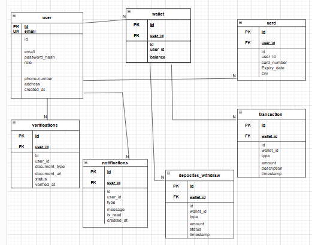

# Digital-Wallet

Documentation for Users API : 
login.php: 
 
1. **Purpose**: Handles user login by validating credentials (`email_phone` and `password`) via a POST request.  
2. **Response Type**: Sets the response type to JSON for all outputs.  
3. **CORS Headers**: Allows cross-origin requests from any domain (`*`), supporting `POST`, `GET`, and `OPTIONS` methods, and permits `Content-Type` and `Authorization` headers.  
4. **Preflight Handling**: Responds to `OPTIONS` preflight requests with a `200 OK` status.  
5. **Data Validation**: Logs received data for debugging and checks if `email_phone` and `password` fields are present.  
6. **Database Query**: Fetches the user’s `id` and `password_hash` from the database using the provided email or phone number.  
7. **Credential Verification**: Compares the provided password with the stored hash using `password_verify()`.  
8. **Success Response**: Returns a JSON response with `success: true`, a success message, and the user’s ID if credentials are valid.  
9. **Error Responses**:  
   - `401 Unauthorized` for invalid credentials.  
   - `400 Bad Request` for missing required fields.  
   - `405 Method Not Allowed` for unsupported HTTP methods.  
10. **Security**: Uses `password_hash()` and `password_verify()` for secure password handling.  
11. **Logging**: Logs received data, successful logins, and invalid credential attempts for debugging.  
12. **Dependencies**: Requires a MySQL database connection (`db.php`) and a `Users` model (`Users.php`) for database interactions.

Documentation for Users API : 
signup.php:

1. **Purpose**: Handles user signup via a `POST` request.  
2. **Input**: Accepts form data (`email`, `password`, `fname`, `lname`, `phone`, `address`, `card_number`, `expiry_date`, `cvv`) and an optional `id_document` file.  
3. **Response Type**: Returns JSON responses for all outputs.  
4. **CORS Headers**: Allows requests from any origin (`*`), supports `POST` method, and permits `Content-Type` header.  
5. **Email Validation**: Checks if the email already exists in the database; returns `400 Bad Request` if it does.  
6. **File Upload**: Saves the `id_document` file to the `uploads/` directory; returns `500 Internal Server Error` if upload fails.  
7. **User Creation**: Creates a new user with the default role `client`; returns `500 Internal Server Error` if creation fails.  
8. **Card Details**: Links the provided card details to the user in the `cards` table; returns `500 Internal Server Error` if card addition fails.  
9. **Success Response**: Returns `200 OK` with `success: true` and a success message if registration is successful.  
10. **Error Responses**:  
    - `400 Bad Request` for missing fields or existing email.  
    - `500 Internal Server Error` for failed file uploads, user creation, or card addition.  
    - `405 Method Not Allowed` for unsupported methods.  
11. **Dependencies**: Requires a MySQL database connection (`db.php`) and the `Users` model (`Users.php`).  
12. **Security**: Ensure secure handling of file uploads and password hashing in production. 
