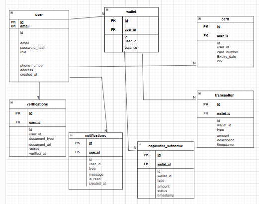

# Digital-Wallet

Documentation for Users API : 
login.php: 
 
1. **Purpose**: Handles user login by validating credentials (`email_phone` and `password`) via a POST request.  
2. **Response Type**: Sets the response type to JSON for all outputs.  
3. **CORS Headers**: Allows cross-origin requests from any domain (`*`), supporting `POST`, `GET`, and `OPTIONS` methods, and permits `Content-Type` and `Authorization` headers.  
4. **Preflight Handling**: Responds to `OPTIONS` preflight requests with a `200 OK` status.  
5. **Data Validation**: Logs received data for debugging and checks if `email_phone` and `password` fields are present.  
6. **Database Query**: Fetches the user’s `id` and `password_hash` from the database using the provided email or phone number.  
7. **Credential Verification**: Compares the provided password with the stored hash using `password_verify()`.  
8. **Success Response**: Returns a JSON response with `success: true`, a success message, and the user’s ID if credentials are valid.  
9. **Error Responses**:  
   - `401 Unauthorized` for invalid credentials.  
   - `400 Bad Request` for missing required fields.  
   - `405 Method Not Allowed` for unsupported HTTP methods.  
10. **Security**: Uses `password_hash()` and `password_verify()` for secure password handling.  
11. **Logging**: Logs received data, successful logins, and invalid credential attempts for debugging.  
12. **Dependencies**: Requires a MySQL database connection (`db.php`) and a `Users` model (`Users.php`) for database interactions.